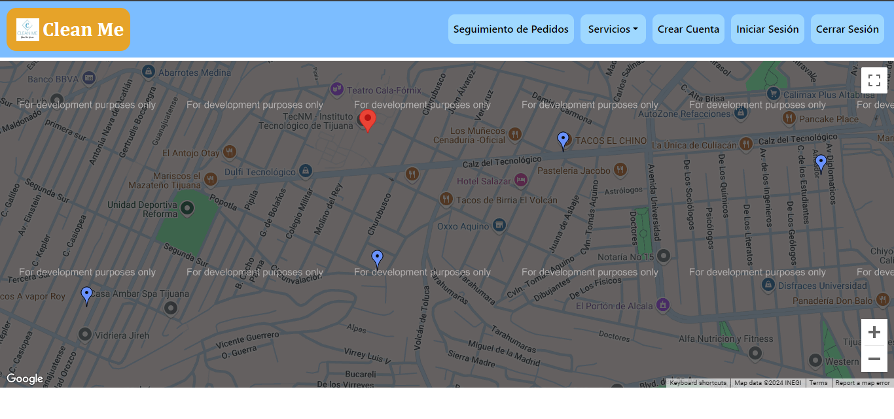

# ***Manual de Usuario***
 Este documento está diseñado para guiarte en el uso y las funcionalidades de la plataforma, proporcionando instrucciones claras y detalladas para que puedas navegar y aprovechar al máximo todos los servicios disponibles.
 
# Página de Inicio

Esta pantalla es lo primero que verás al entrar en la aplicación. En ella, se encuentra el nombre de la empresa, una cálida bienvenida y información sobre los servicios que ofrecemos, así como una pequeña guía sobre cómo funciona nuestro servicio.

Al ingresar a la aplicación, lo primero que captará tu atención será esta pantalla inicial. En ella, destaca prominentemente el nombre de nuestra empresa, diseñado para causar una impresión positiva y duradera. Además, hemos incluido una bienvenida cordial para que te sientas valorado y apreciado desde el primer momento.

En esta misma pantalla, encontrarás una descripción detallada de los diversos servicios que ofrecemos. Esta información está organizada de manera clara y accesible, asegurando que puedas familiarizarte rápidamente con todo lo que podemos proporcionarte. Nos esforzamos por ofrecer un panorama comprensible de nuestras capacidades y especialidades.

También hemos incorporado una pequeña guía que explica de manera sencilla y directa cómo funciona nuestro servicio. Esta guía está diseñada para ser intuitiva y útil, brindándote los pasos esenciales que debes seguir para sacar el máximo provecho de la aplicación. Creemos que una orientación inicial clara es crucial para asegurar una experiencia fluida y satisfactoria.

En la parte superior izquierda de la pantalla de inicio, encontrarás el nombre de la empresa y el logo, todo en color blanco.

Además, hay una serie de opciones ubicadas en la parte superior de la ventana que te permitirán navegar entre las distintas funcionalidades que ofrece el programa. Entre estas opciones se encuentran: seguimiento de pedidos, servicios, crear cuenta, iniciar sesión y cerrar sesión.

# Barra de Navegación

La barra de navegación es como el mapa de un parque de diversiones, guiándote a través de las diferentes atracciones de la aplicación. Aquí encontrarás varias opciones que facilitarán tu experiencia como usuario.

- **Clean Me**: El botón “Clean Me” te dirige a la página principal, donde podrás ver la información general de la empresa y nuestro contacto. Al hacer clic en este botón, serás llevado a una página que ofrece una visión completa de quiénes somos, nuestra misión y valores, y cómo puedes comunicarte con nosotros para cualquier consulta o necesidad adicional.

- **Seguimiento de Pedidos**: El botón “Seguimiento de Pedidos” te lleva a la página donde puedes verificar el seguimiento de tus pedidos. En esta sección, podrás ver el estado actual de tus pedidos en tiempo real, como si estuvieras rastreando el progreso de un paquete en un mapa. También podrás realizar modificaciones a tus pedidos, ajustando detalles según tus necesidades cambiantes, e incluso cancelar un pedido si lo deseas.

- **Servicios**: El botón “Servicios” despliega las diferentes opciones de servicios que ofrecemos. Al interactuar con este botón, podrás explorar un menú detallado que incluye todas las opciones disponibles, como un buffet donde eliges lo que más te apetece. Cada servicio está descrito con claridad, proporcionando toda la información necesaria para que tomes decisiones informadas.

- **Crear Cuenta**: El botón “Crear Cuenta” te permite insertar tu información para registrarte como usuario. Esta funcionalidad es como abrir la puerta a un club exclusivo; al crear una cuenta, deberás proporcionar datos básicos como nombre, dirección de correo electrónico y una contraseña segura.

- **Iniciar Sesión**: El botón “Iniciar Sesión” te permite ingresar tus credenciales para acceder a tu cuenta personal. Esta opción está destinada a usuarios registrados que desean entrar a su propio espacio, asegurando que solo tú puedas acceder a tu información personal y pedidos.

- **Cerrar Sesión**: El botón “Cerrar Sesión” te permite salir de tu sesión de usuario. Es como cerrar la puerta detrás de ti al salir de un lugar, asegurando que tu información personal esté protegida y que tu cuenta no pueda ser accedida por otros una vez que hayas terminado de usar la aplicación. Este botón es esencial para mantener la seguridad y privacidad de tus datos.
  

# Servicios

El botón “Servicios” te permite explorar las diferentes opciones de servicios que ofrecemos. Al hacer clic en este botón, serás dirigido a una página donde podrás ver un menú detallado que incluye todas las opciones disponibles.

- **Pedidos**: El botón “Pedidos” te dirige a la página de pedidos, donde podrás realizar diferentes pedidos de productos si has iniciado sesión. Esta página está diseñada para ser intuitiva y fácil de navegar, permitiéndote explorar una amplia gama de productos. Una vez que hayas iniciado sesión, podrás seleccionar los artículos que deseas comprar, añadirlos a tu carrito y proceder con el proceso de compra de manera rápida y eficiente. Este botón es fundamental para facilitar el acceso directo a la función principal de realizar pedidos.

- **Historial**: El botón “Historial” te lleva a la página de historial de pedidos, donde podrás ver todos los pedidos completados. En esta sección, podrás revisar todos los pedidos que has realizado previamente. La información está organizada cronológicamente, permitiéndote ver detalles como fechas de compra, productos adquiridos, cantidades y el estado de cada pedido. Esta funcionalidad es muy útil para llevar un control de tus compras y realizar un seguimiento de tu actividad en la plataforma.

- **Orden de Servicio**: El botón “Orden de Servicio” es para que los empleados puedan crear la orden de servicio cuando se completa un pedido. Esta opción está diseñada específicamente para el uso interno del personal de la empresa. Al acceder a esta función, los empleados pueden generar y gestionar órdenes de servicio, asegurando que todos los pedidos sean procesados y completados de manera eficiente. Este botón es crucial para mantener la operatividad interna y asegurar que se cumplan los tiempos de entrega y la satisfacción del cliente.

- **ChatBot**: El botón “ChatBot” te dirige a la página del asistente virtual para los pedidos. Esta herramienta ofrece una forma rápida y conveniente de obtener ayuda con tus pedidos. Al interactuar con el ChatBot, podrás hacer preguntas, recibir recomendaciones y obtener asistencia en tiempo real. Esta función está diseñada para mejorar tu experiencia como usuario, proporcionando soporte inmediato y reduciendo el tiempo de espera para resolver consultas o problemas relacionados con tus pedidos.

 
# Crear Cuenta

Cuando seleccionas el botón de “Crear Cuenta”, serás dirigido a una pantalla donde verás varios campos que necesitarás llenar. Esta pantalla de registro está diseñada para recopilar toda la información necesaria para crear una cuenta personalizada y segura. Al proporcionar estos datos, podrás disfrutar de una experiencia más adaptada a tus necesidades y acceder a todas las funcionalidades de la plataforma de manera completa y eficiente.

Los campos que deberás completar son:

- **Nombre de usuario**: Este campo te permite elegir un identificador único para tu cuenta. Acepta letras, símbolos especiales y números, pero no se permitirán “espacios”.

- **Correo electrónico**: Este campo es crucial para la verificación de tu cuenta y para todas las comunicaciones importantes. Debe contener un formato válido, incluyendo “@” y no puede tener “espacios”.

- **Contraseña**: Aquí deberás crear una contraseña segura. Este campo permite caracteres de todo tipo, y es tu responsabilidad mantener la confidencialidad de tu contraseña.

- **Confirmación de contraseña**: Debes ingresar nuevamente tu contraseña para asegurarte de que la has escrito correctamente.

- **País**: Indica el nombre del país en el que te encuentras. Solo se permitirá la entrada de texto con un nombre de país real y verificable.

- **Calle**: Especifica el nombre de la calle en la que resides. Este campo ayuda a ubicarte con precisión para futuros servicios.

- **Código postal**: Introduce tu código postal. Este campo es esencial y solo permite la entrada de números, asegurando que sea un código postal válido.

- **Número exterior**: Indica el número exterior de tu residencia. Este campo permite valores numéricos y letras.

- **Número interior** (opcional): Si corresponde, puedes ingresar el número interior de tu hogar para una ubicación más precisa.

- **Indicaciones del domicilio**: Proporciona instrucciones adicionales para facilitar las entregas.

Una vez que hayas completado todos los campos, podrás presionar el botón “Registrarse” para crear tu cuenta. Al hacer clic, el sistema verificará que todos los campos obligatorios estén completos y que la información sea válida. Si todo está en orden, tu cuenta se creará y serás dirigido a una pantalla de bienvenida o a tu nuevo perfil. Este proceso asegura que puedas comenzar a usar la plataforma de inmediato, con todos tus datos registrados para una experiencia óptima y sin inconvenientes.

# Iniciar Sesión

Cuando seleccionas el botón de “Iniciar Sesión”, serás dirigido a una nueva pantalla donde verás varios campos que deberás completar. Esta pantalla está diseñada para facilitar el proceso de inicio de sesión, asegurando que puedas acceder a tu cuenta de manera rápida y segura.

Los campos que deberás completar son los siguientes:

- **Usuario o correo electrónico**: En este campo, deberás ingresar tu nombre de usuario o la dirección de correo electrónico que utilizaste al registrarte en la plataforma. Este campo acepta letras, números y caracteres especiales. Es crucial que proporciones la información correcta para garantizar un acceso sin problemas.

- **Contraseña**: Aquí deberás ingresar la contraseña que estableciste al crear tu cuenta. Este campo admite todo tipo de caracteres, incluyendo letras, números y caracteres especiales. Es importante que introduzcas tu contraseña con precisión para evitar errores de inicio de sesión.

Una vez que ambos campos hayan sido llenados correctamente, podrás presionar el botón “Entrar” para iniciar sesión. Al hacer clic en este botón, el sistema verificará que las credenciales proporcionadas coincidan con las registradas en nuestra base de datos. Si la información es correcta, serás autenticado y podrás acceder a tu cuenta de inmediato. Este proceso asegura que solo los usuarios autorizados puedan ingresar, protegiendo la seguridad y privacidad de cada cuenta.

# Pedidos

Cuando seleccionas el botón desplegable de “Servicios” y presionas sobre la opción de “Pedidos”, serás dirigido a una nueva pantalla donde verás varios campos que necesitarás llenar. Estos campos están relacionados con el pedido que deseas realizar.

Inicialmente, deberás seleccionar entre las opciones disponibles para describir el tipo de ropa que incluirás en tu pedido. Las opciones son:

- **Color**: Indica que el pedido contiene únicamente ropa de color. Al seleccionar esta opción, aseguras que la ropa de color recibirá el tratamiento adecuado.
  
- **Blanco**: Indica que el pedido contiene únicamente ropa blanca. Al elegir esta opción, garantizas que la ropa blanca mantenga su blancura y calidad.
  
- **Mixto**: Describe que el contenido del pedido será mixto, es decir, incluirá tanto ropa blanca como de color. Esta selección asegura que ambas categorías de ropa sean tratadas apropiadamente.

Para los demás detalles del pedido, hay un apartado donde deberás marcar el tipo de producto o prenda que deseas lavar, seguido de la cantidad de unidades. Al marcar el producto, se expandirá un campo donde podrás modificar la cantidad según tus necesidades.

Al final del apartado, verás la cantidad total de prendas en el pedido, el peso total y el costo total sumado de los diferentes productos. Estos campos son solo informativos y no modificables, para que tengas claridad sobre lo que estás pidiendo y el costo del servicio.

## Dirección del Pedido

Aquí encontrarás información crucial para entregar el pedido a la dirección que especifiques. Podrás escribir la dirección a la que quieres que llegue y se recoja el pedido para lavar. La información incluye:

- **País**: Este campo solo acepta valores alfabéticos y debe corresponder a un país reconocido internacionalmente.

- **Estado**: Este campo también solo acepta valores alfabéticos, y los valores ingresados deben ser válidos según la base de datos interna de estados o provincias.

- **Ciudad**: Registra la ciudad en la que resides. Este campo está restringido a recibir solo valores alfabéticos y debe ser válido según la base de datos.

- **Colonia**: Registra la colonia o barrio específico donde resides. Este campo aceptará solo valores alfabéticos y debe coincidir con registros válidos.

- **Calle**: Este campo almacenará la calle específica en la que resides, aceptando únicamente valores alfabéticos.

- **Código Postal**: Este campo se encarga de almacenar el código postal correspondiente a tu ubicación, recibiendo valores válidos según la base de datos.

- **Número Exterior**: Este campo acepta exclusivamente valores numéricos y debe coincidir con una ubicación válida en la dirección declarada.

- **Número Interior**: Este campo es opcional y puede aceptar valores alfabéticos, numéricos y símbolos especiales.

- **Indicaciones para el Conductor**: Este campo permite escribir instrucciones adicionales que faciliten la localización de la dirección. Las indicaciones claras ayudan a evitar confusiones y retrasos.

De manera predeterminada, se llenará la información de la dirección con la proporcionada al registrarte, lo que hace más cómodo el llenado de pedidos.

## Especificaciones del Pedido

El campo de especificaciones permite dar indicaciones adicionales sobre el lavado de tus prendas, como cuidados especiales o cómo organizar la ropa (por tonos, tamaño, tipo de prenda, etc.).

Una vez que hayas seleccionado las opciones correspondientes y llenado los campos necesarios, podrás ver un resumen del pedido al presionar el botón final. Este resumen te permitirá revisar todos los detalles antes de confirmarlo, asegurando que toda la información sea correcta. Este proceso es crucial para garantizar que la sucursal reciba y procese tu pedido de manera eficiente y precisa, proporcionando el mejor servicio posible.

# Resumen del Pedido

Al presionar el botón final en el paso anterior (“Ver resumen del pedido”), se desplegará una ventana donde podrás ver todo lo que has pedido, así como modificar las cantidades y eliminar productos.

En esta ventana, encontrarás dos botones:

- **Cerrar**: Te permite continuar agregando o modificando elementos en el pedido.
- **Enviar Pedido**: Este botón se utiliza para enviar el pedido una vez que estés satisfecho con la información.

Si el pedido es extenso, puedes utilizar la barra de desplazamiento lateral en el lado derecho de la ventana para navegar por los detalles de los productos.

Esta ventana te permite modificar el pedido antes de finalizarlo, actuando como una segunda verificación para evitar que realices un pedido incompleto o con prendas de más. Es bastante útil y sencilla de comprender.

El formato de la interfaz ofrece una tabla bien estructurada que muestra claramente tres campos principales relacionados con los productos:

- **Producto**: Este campo lista los nombres de los productos que deseas adquirir. Cada fila corresponde a un producto específico, proporcionando una descripción clara y precisa del artículo seleccionado.
  
- **Cantidad**: Aquí se especifica la cantidad de cada producto que deseas comprar. Los valores son numéricos, permitiendo ajustar la cantidad según tus necesidades.

- **Precio por Unidad**: Este campo muestra el precio unitario de cada producto listado, expresado en la moneda correspondiente. Es esencial para ver el costo individual de cada artículo.

Al final de la tabla, se presenta un campo que muestra la suma total del costo del pedido, que se actualiza automáticamente con cada modificación.

En el extremo derecho de cada fila de la tabla, se encuentra un campo denominado "Eliminar". Este botón tiene una forma cuadrada con bordes redondeados, de color rojo con letras blancas que contrastan, facilitando su visibilidad. Al hacer clic en este botón, puedes eliminar el producto correspondiente de la tabla.

En la parte inferior derecha de la pantalla, la interfaz presenta dos botones diseñados para acciones críticas:

- **Enviar Pedido**:
  - **Diseño y Estilo**: Botón con bordes redondeados y apariencia suave.
  - **Color y Texto**: Color azul con letras blancas, lo que lo hace destacar.
  - **Funcionalidad**: Al hacer clic, puedes enviar el pedido para su procesamiento.

- **Cerrar**:
  - **Diseño y Estilo**: Similar al botón de enviar pedido, con bordes redondeados.
  - **Color y Texto**: Color gris con letras blancas, indicando que es una acción secundaria.
  - **Funcionalidad**: Al hacer clic, puedes cerrar la interfaz actual, posiblemente cancelando o suspendiendo la acción en curso.

# Seguimiento de Pedidos

Cuando selecciones el botón de “Seguimiento de Pedidos”, serás dirigido a una pantalla donde podrás ver todos los pedidos realizados por los usuarios. Aquí tendrás acceso a detalles como el ID del pedido, información del usuario y detalles del pedido.

La tabla de seguimiento de Pedidos contiene las siguientes columnas con la información del pedido:

- **ID Pedido**: Identificador que permite saber de qué pedido se está hablando.
  
- **Correo Cliente**: Muestra el correo electrónico del usuario que realizó el pedido.

- **Sucursal y Teléfono**: Proporciona el nombre de la sucursal junto con la manera de contactar a dicha sucursal.

- **Tipo de Lavado**: Describe si la orden es a Color, Blanco o Mixta (algunas prendas a color y otras en blanco). En caso de ser mixta, es necesario que el cliente separe la ropa.

- **Especificaciones**: Detalles adicionales que realiza el cliente sobre el pedido.

- **Pago**: Costo total del pedido.

- **Fecha Inicio**: Fecha en la que se realiza la orden del pedido.

- **Dirección**: Dirección donde se va a entregar el pedido.

- **Detalles**: Conjunto de prendas que contiene el pedido, especificando el nombre de la prenda, la cantidad y el peso.

- **Acciones**: Esta columna incluye dos botones para modificar o cancelar la orden:
  - **Cancelar**: Elimina el pedido de los registros del usuario y de la sucursal.
  - **Modificar**: Permite al usuario agregar, modificar o eliminar productos para actualizar el registro del pedido.

Cada pedido puede ser modificado y cancelado, teniendo en cuenta que no se ha realizado el pedido todavía. Al cancelar el pedido, este se elimina de los registros del usuario. Al modificarlo, se actualizan los detalles del pedido conforme a las nuevas especificaciones que introduzca el usuario.

Si tienes múltiples pedidos, podrás visualizar el resto utilizando la barra de desplazamiento lateral del lado derecho de la ventana, desplazándola de arriba a abajo para navegar por los pedidos. Si la ventana está minimizada, también podrás verificar las diferentes columnas que contienen los detalles del pedido mediante una barra de desplazamiento horizontal, desplazándola de iz

# Modificar Pedido

Al seleccionar la opción de “Modificar”, podrás cambiar los detalles del pedido y enviarlo una vez que todo sea correcto. En esta ventana, se mostrarán todas las prendas que puedes ajustar en el pedido. Al modificar las cantidades de cada prenda, el costo total del pedido se reflejará en tiempo real.

Dentro de esta ventana aparecen tres columnas diferentes:

- **Producto**: Contiene el nombre del producto/prenda que se puede modificar en el pedido.

- **Cantidad**: Indica la cantidad unitaria del producto que se va a lavar en el pedido.

- **Precio por Unidad**: Indica el precio por pieza de cada producto/prenda.

- **Total Pedido**: Muestra la cantidad total a pagar por el pedido.

Cada prenda tiene un precio específico por unidad, que se sumará al total del precio del pedido en la parte inferior derecha. Si la cantidad de una prenda es cero, esta no se agrega a la información del pedido; solo aparecerán aquellas prendas que estén registradas con una cantidad en el pedido. Esto evita un despliegue innecesario de información para el usuario y la creación de registros innecesarios en la base de datos de la empresa.

Para finalizar la modificación del pedido, es necesario que hagas clic en el botón “Enviar Pedido”. Si decides no realizar modificaciones, simplemente haz clic en “Cerrar”.

# Historial

Cuando el usuario seleccione el botón desplegable de “Servicios” y presione sobre la opción de “Historial”, será dirigido a una pantalla donde podrá ver todos los pedidos realizados hasta el momento. En esta sección, se muestran los siguientes detalles:

- **ID Pedido**: Es el identificador que permite saber al usuario y a los empleados a qué pedido se refiere.

- **Correo Cliente**: Muestra el correo electrónico del usuario que realizó el pedido.

- **Sucursal y Teléfono**: Proporciona el nombre de la sucursal junto con la manera de contactar a dicha sucursal.

- **Tipo de lavado**: Describe si la orden es a Color, Blanco o Mixta (algunas prendas a color y otras en blanco). En caso de que sea mixta, es necesario que el cliente separe la ropa.

- **Especificaciones**: Incluye las especificaciones adicionales que realiza el cliente sobre el pedido.

- **Pago**: Es el costo total del pedido.

- **Fecha Inicio**: Es la fecha en que se realiza la orden del pedido.

- **Fecha Fin**: Es la fecha en que se finaliza la orden del pedido.

- **Dirección**: Es la dirección a la que se va a entregar el pedido.

- **Detalles**: Es el conjunto de prendas que contiene el pedido, especificando el nombre de la prenda, la cantidad y el peso.

# ChatBot

Cuando el usuario seleccione el botón desplegable de “Servicios” y presione sobre la opción de “ChatBot”, será dirigido a una pantalla donde podrá ver una interfaz de chat en tiempo real. En esta pantalla, el usuario podrá interactuar con un asistente virtual que le ayudará con diversas consultas y tareas.

El asistente virtual cumple las siguientes funciones:

- **Asistencia Instantánea**: Aclara dudas sobre el proceso de pedido y el lavado de la ropa.
- **Información General**: Proporciona datos relevantes sobre la empresa.
- **Asistente para Procesos**: Ayuda en todas las funcionalidades disponibles en la página web.

Además, este asistente mejora la experiencia del usuario al ofrecer asistencia personalizada, reduce la carga del servicio al cliente al automatizar respuestas a preguntas frecuentes y aumenta la interacción de los usuarios con la página web.

El usuario debe escribir sus preguntas en una caja de texto. Después de escribir, puede presionar la tecla ENTER o el botón “Enviar” para iniciar la conversación con el asistente virtual. Una vez realizada la pregunta, el asistente proporcionará la respuesta más cercana a lo que se ha solicitado.

# Mapas

Cuando el usuario seleccione el botón desplegable de “Servicios” y presione sobre la opción de “Mapas”, será dirigido a una pantalla donde podrá ver las lavanderías alrededor de su área. 

En esta página se pueden visualizar todas las sucursales y lavanderías afiliadas con Clean Me. El usuario podrá acceder a la información de cada sucursal, incluyendo:

- **Nombre de la Sucursal**
- **Número de Contacto**
- **Distancia desde su Ubicación Actual**

Además, el usuario tendrá la opción de expandir el mapa para visualizar todos los locales disponibles en su ciudad, estado o país.

Esta funcionalidad le permite al usuario consultar todas las sucursales disponibles para realizar pedidos en su área, brindándole más seguridad al momento de hacer sus pedidos, ya que podrá identificar la ubicación de la sucursal y contactarla directamente.

# Órdenes de Servicio

Cuando el empleado seleccione el botón desplegable de “Servicios” y presione sobre la opción de “Orden de Servicio”, será dirigido a una pantalla donde podrá ver las órdenes de servicio pendientes.

## Información Disponible

- **ID Pedido**: Identificador que permite saber de qué pedido se está hablando.
- **Sucursal y Teléfono**: Proporciona el nombre de la sucursal y la forma de contactar a la misma.
- **Tipo de Lavado**: Indica si la orden es a Color, Blanco o Mixta (Algunas prendas a color y otras en blanco). En caso de ser mixta, es necesario que el cliente separe la ropa.
- **Especificaciones**: Especificaciones adicionales proporcionadas por el cliente sobre el pedido.
- **Pago**: Costo total del pedido.
- **Fecha Inicio**: Fecha en que se realiza la orden del pedido.
- **Dirección**: Dirección de entrega del pedido.
- **Acción**: Columna con el botón que permite al empleado marcar el pedido como completado, generando una orden de servicio para la sucursal.

## Funcionalidad

En esta página, el empleado de la sucursal puede verificar todos los pedidos pendientes de completar. La información contenida permite identificar a dónde y a quién se está enviando. Al finalizar un pedido, esta página sirve para realizar una orden de servicio que marca el pedido como completado y mantiene un registro de todos los pedidos finalizados en la sucursal.

# Ver Órdenes de Servicio

Cuando el empleado seleccione el botón desplegable de “Servicios” y presione sobre la opción de “Ver Órdenes de Servicio”, será dirigido a una pantalla donde podrá ver todas las órdenes que han sido completadas.

## Información Disponible

- **ID Orden**: Identifica el número de la orden de servicio.
- **ID Pedido**: Identifica el número del pedido asociado.
- **ID Empleado**: Identifica el número de empleado de la sucursal que completó la orden.
- **Nombre Empleado**: Muestra el nombre del empleado que realizó la orden de servicio.
- **ID Usuario**: Es el número del usuario que realizó el pedido.
- **Nombre Usuario**: Es el nombre del cliente que realizó el pedido.
- **Fecha**: Muestra la fecha en que se realizó la orden de servicio y la finalización del pedido.

## Funcionalidad

En esta página, el empleado podrá verificar las órdenes completadas, con acceso a la información del usuario y la fecha de finalización. Esto facilita la tarea del empleado al permitirle revisar las Órdenes de Servicio que se realizaron en esa sucursal de manera sencilla y efectiva.

